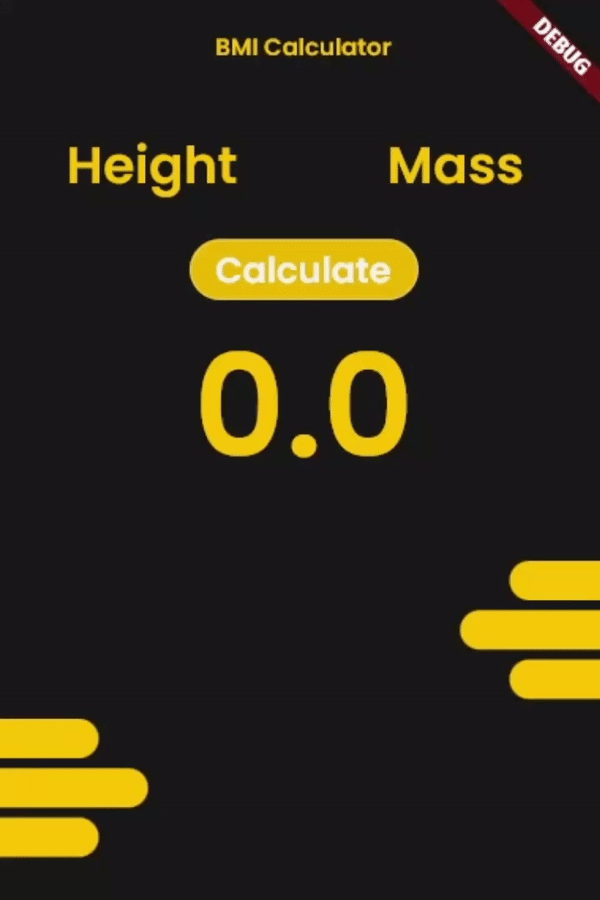

# BMI Calculator
##### Body Mass Index
A Complete Flutter project.

BMI is a measurement of a person's leanness or corpulence based on their height and weight, and is intended to quantify tissue mass. It is widely used as a general indicator of whether a person has a healthy body weight for their height.

## Features
1. Input Height
2. Input Mass
3. Calculate BMI
4. Categorize BMI Result 

### Equation
mass/height^2

### Prototype

